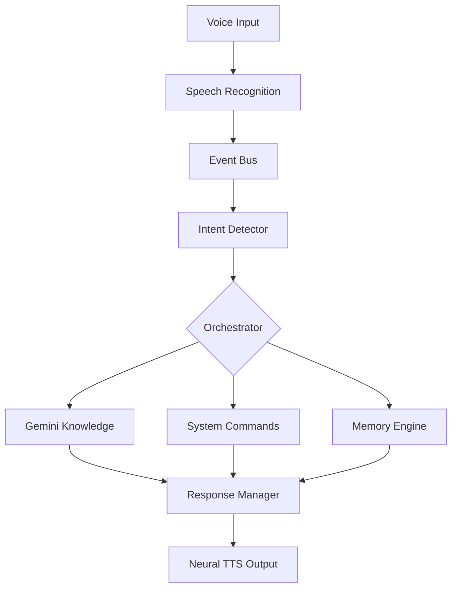

# 🧠 J.A.R.V.I.S — Pro Edition AI Assistant

<p align="center">
  
  
  
</p>

<p align="center">
  <b>Just A Rather Very Intelligent System</b><br>
  A professional-grade, ultra-responsive AI companion inspired by Stark Industries' JARVIS.
</p>

---

## 🚀 Project Improvements (Pro Edition)
> [!IMPORTANT]
> This repository has been recently upgraded to **Professional Architecture**.
> - **Gemini Integration**: Now powered by Google Gemini for ultra-fast, intelligent reasoning.
> - **Neural Voice Engine**: Switched to high-fidelity Edge-TTS for human-like natural speech.
> - **Flash Logic**: Bypassed heavy translation delays for real-time "Flash" responses.
> - **Follow-up Window**: Implemented a 10-second active listening window for natural conversation flow.
> - **Smart Repeat**: Instant playback functionality for repeating last responses.

---

## ✨ Overview

**J.A.R.V.I.S** is not just a script; it's a modular ecosystem for AI interaction. It combines real-time speech recognition, advanced intent detection, and multi-layered memory to provide a seamless assistant experience.

Built with a focus on **latency optimization** and **architectural elegance**, it supports Hinglish (Hindi + English) naturally, making it perfect for bilingual users.

---

## 🛠 Features

| Feature | Description |
| :--- | :--- |
| 🧠 **Hinglish Brain** | Understands and speaks in mixed Hindi/English naturally. |
| 👁️ **Vision Analysis** | Can "see" your screen and answer questions about what's visible. |
| 💾 **Long-Term Memory** | Remembers past interactions and learns from corrections. |
| 🎙️ **Streaming TTS** | Starts speaking long paragraphs sentence-by-sentence to reduce latency. |
| ⚙️ **System Control** | Manage apps, volume, brightness, and system states via voice. |
| 🏥 **Wellness Tracker** | Proactively reminds you to drink water, exercise, and take breaks. |
| 📅 **Productivity** | Built-in task manager with daily routines and reminders. |

---

## 🏗 Modular Architecture

The project follows a decoupling principle using a central **Event Bus**.



### Directory Structure
- `brain/`: The "Spirit" — Gemini logic, memory engines, and task agents.
- `core/`: The "Spine" — Audio drivers, state management, and runtime monitors.
- `commands/`: The "Hands" — Individual command handlers for system automation.
- `ui/`: The "Face" — Futuristic HUD and visual feedback system.

---

## 🚦 Quick Start

### 1. Prerequisites
- Python 3.10+
- Internet connection (for Gemini & Edge-TTS)

### 2. Installation
```powershell
# Clone the repository
git clone https://github.com/mishraji018/Voice_assistant_anti.git
cd Voice_assistant_anti

# Create virtual environment
python -m venv venv
.\venv\Scripts\activate

# Install requirements
pip install -r requirements.txt
```

### 3. Setup Environment
Create a `ni.env` file in the root directory and add your API keys:
```env
GEMINI_API_KEY=your_key_here
```

### 4. Run
```powershell
python main.py
```

---

## 👨‍💻 Author

**Pawan Mishra**
*Computer Science Student | AI Full-Stack Developer*

[](https://github.com/mishraji018)
[](https://pawan-mishra.com)

---

## ⭐ Support
If this project inspired you or helped your research, please give it a **Star**! It keeps the development alive.

<p align="center">
  Built with ❤️ by Pawan Mishra
</p>
